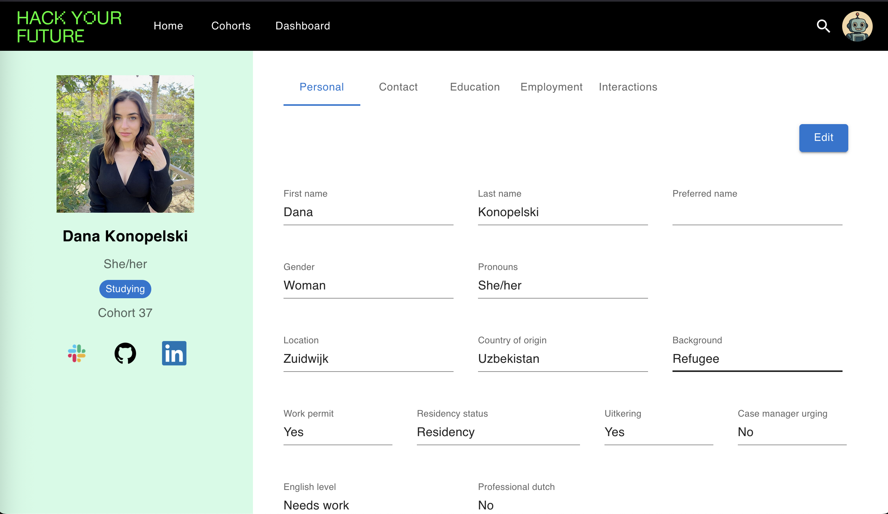
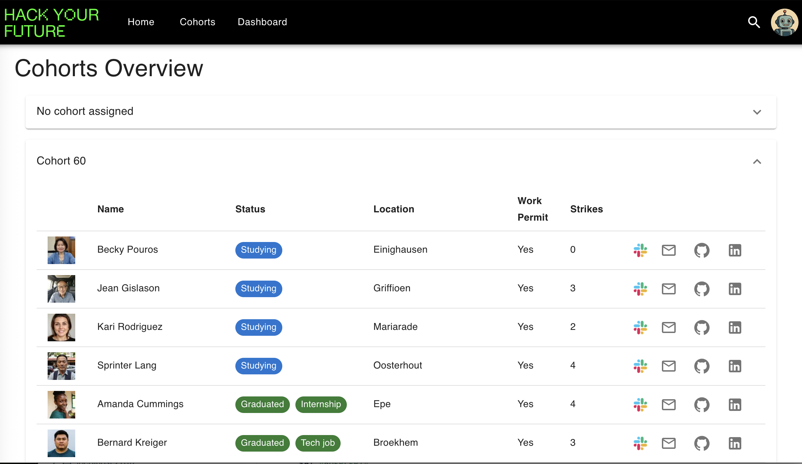
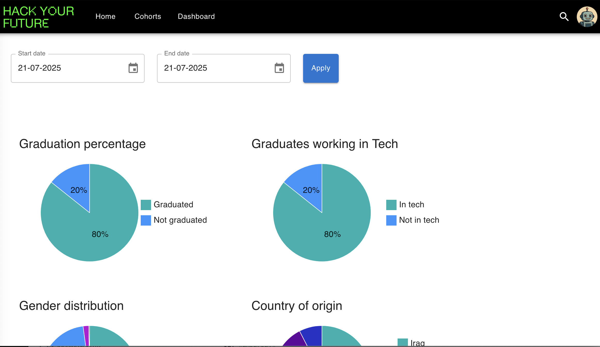

# Dojo

## Overview

Dojo is HackYourFuture's in-house management tool designed to track HackYourFuture trainee progress, performance, attendance, assignments, graduation status, and other relevant data, facilitating efficient management of trainees information.

## Screenshots
<table>
   <tr>
      <td></td>
      <td></td>
   </tr>
   <tr>
      <td></td>
      <td></td>
   </tr>
</table>

## Table of contents

- [Features](#features)
- [Technology Stack](#technology-stack)
- [Getting Started](#getting-started)
- [Usage](#usage)
- [Contributing](#contributing)
- [License](#license)
- [Contact](#contact)

## Features

- Search for trainees
- View and update trainee profile
- Track trainee progress and performance
- Generate real-time reports
- Cohorts overview
- Secure authentication using Google OAuth

## Technology Stack

This project is built using the MERN stack.
### Front-end


### Back-end


## Getting Started

### Prerequisites

Ensure you have the following installed:

- Node.js version 22 or above
- npm

### Option 1: Express setup for front-end development only
If you only work on the front-end, you can connect to a remote deployed backend instead of running a server locally. This saves some time and configuration.

1. Run the following command in the root directory:
   ```bash
   npm run setup
   ```
2. Navigate to the front-end directory:
   ```bash
   cd client
   ``` 
3. Copy `.env.example` to `.env`
4. Replace `VITE_BACKEND_PROXY_TARGET` and `VITE_GOOGLE_CLIENT_ID` with the correct values of the test server
5. Start the app:
   ```bash
   npm run dev
   ``` 

6. The app should be accessible at http://localhost:5173/

### Option 2: Full setup (front-end & back-end)

1. Run the following command in the root directory:

   ```bash
   npm run setup
   ```

2. Set up the server from the detailed instructions in [server/README.md](server/README.md). Make sure the back-end is running before setting up the front-end.

3. Set up the client from the detailed instructions in [client/README.md](client/README.md)

4. The back-end should be accessible at http://localhost:7777/ and the front-end should be accessible at http://localhost:5173/


## Usage

1. Navigate to `http://localhost:5173` in the browser.
2. Log in with an authorized google account.
3. Search for a trainee to track trainee progress, contact information, employment status etc...
4. Use the cohorts overview page to see the full list of trainees.

## Login issues
Make sure:
1. The `.env` files are set up correctly on both front-end and back-end with the correct Google client ID and secret.
2. The Google account you try to authenticate is in the Dojo database.
3. The Google account is on the list of the test users for the OAuth authentication in Google console.

Refer to the server and client documentation for more details.


## Contributing

Contributions are welcome by opening a pull request:

1. Fork the repository.
2. Create a new branch (`git checkout -b feature/your-feature-name`).
3. Commit your changes (`git commit -m 'Add some feature'`).
4. Push to the branch (`git push origin feature/your-feature-name`).
5. Open a Pull Request.
6. Make sure the deployment build is successful.

## License

This project is licensed under the MIT License - see the [LICENSE](LICENSE) file for details.

## Contact

For any inquiries or feedback, please contact the dojo team on Slack or open an issue.