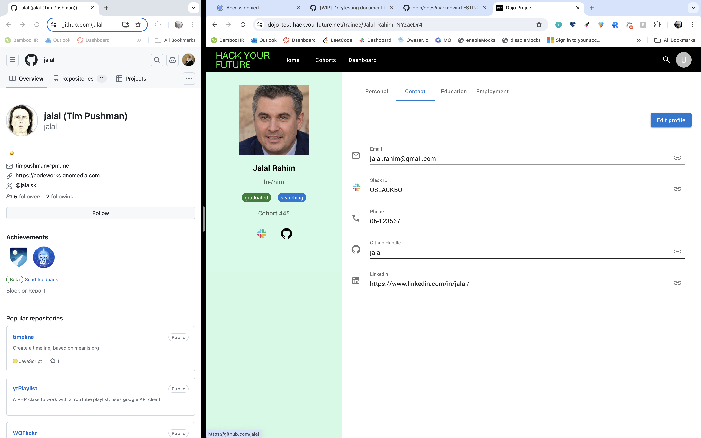

# DOJO Testing Document

## Test Plans

### Unit testing

Unit tests will be slowly implemented after the first release of the application and within the time constraints.

The implementation will be in stages:

1. Unit tests for the most critical flows of the application.
2. Unit tests for the most common flows.
3. All other low priority unit tests.

We will use the popular [Jest](https://jestjs.io/) library to implement unit tests.

### Integration testing

In the future, automated tests can be implemented with [cypress].
The tests will run on a fixed cadence and report any issues.

Having automated tests has potential to greatly improve the quality of the application.

### System testing

Tests will be added later to the complete integrated system to ensure it meets the specified requirements.

Testing will be for the entire system's functionality, performance, security, and usability.

Tools can be used: [Selenium], [JMeter] (for performance testing), [OWASP-ZAP] (for security testing), etc.

### User Acceptance testing (UAT)

UAT testing was done per PR by Project team and Education Director to validate the system meets the needs and requirements.

## Test Cases

| Test Case ID |                    Test Case Description                    |                                                  Input Data                                                   |                                               Expected Output                                               |                                          Actual Output                                          |
| :----------: | :---------------------------------------------------------: | :-----------------------------------------------------------------------------------------------------------: | :---------------------------------------------------------------------------------------------------------: | :---------------------------------------------------------------------------------------------: |
|     TC01     |                  Redirection without login                  |                                  Going to Home page (User is not logged in)                                   |                                          Redirection to Login Page                                          |  |
|     TC02     |               Login with an unauthorized user               |                          Click Login with Google button and enter unauthorized email                          |                           Failure login with Error message and stay in Login page                           |  |
|     TC03     |                Login with an authorized user                |                         Click Login with Google button and enter an authorized email                          |                                  Success login and redirect to Search page                                  |  |
|     TC04     |                    Logout functionality                     |                            Open user menu from top-right and click Log out button                             |                             Successfully logged out and redirect to Login page                              |  |
|     TC05     |                Searching for a user (random)                |                                 Type a name in search box (ex: Maher alarabi)                                 |                                  No results found! (in search result list)                                  |  |
|     TC06     |                    Searching for a user                     |                                     Type a name in search box (ex: jalal)                                     |                                         A list with founded results                                         |  |
|     TC07     |                       Trainee profile                       |                          click on a name in the search result list (ex: jalal Rahim)                          |                                     Redirection to Trainee profile page                                     |  |
|     TC08     |               Trainee profile Sidebar buttons               |                                 click on Slack / Github / Linkedin icon icon                                  |                       Redirection to Trainee Slack / Github / Linkedin profile pages                        |  |
|     TC09     |          Trainee Personal tab - Edit functionality          |                                          Click 'Edit profile' button                                          |     Change all inputs from `readonly` to `outlined` (Edited) inputs and show 'Save' & 'Cancel' buttons      |  |
|     TC10     |         Trainee Personal tab - Cancel functionality         |                               Edit some trainee info and click 'Cancel' button                                | Inputs will be back to `readonly` view and the edited fields will be back to origin state (before editing)  |  |
|     TC11     |    Trainee Personal tab - Edit functionality with error     |        Click 'Edit profile' button, edit some trainee info and click 'Save' button (Network has error)        |                   Show 'Error saving trainee data' error message and stay in `Edit` mode                    |  |
|     TC12     |          Trainee Personal tab - Save functionality          |                             Edit some trainee info again and click 'Save' button                              | Show 'Trainee data saved successfully' message and turn to `readonly` mode (PS: Only sending edited fields) |  |
|     TC13     |                     Trainee Contact tab                     |                                  Click 'Contact' tab from the profile Navbar                                  |                                     Redirecting to Trainee Contact page                                     |  |
|     TC14     |                 Trainee Contact tab - Email                 |                                Click `link` icon on the right of 'Email' field                                |                                            Open New Email window                                            |  |
|     TC15     |                 Trainee Contact tab - Slack                 |                              Click `link` icon on the right of 'Slack ID' field                               |                                            Open New Slack window                                            |  |
|     TC16     |                Trainee Contact tab - Github                 |                            Click `link` icon on the right of 'Github Handle' field                            |                                Open Trainee Github profile page in a new tab                                |  |
|     TC17     |               Trainee Contact tab - Linkedin                |                              Click `link` icon on the right of 'Linkedin' field                               |                               Open Trainee Linkedin profile page in a new tab                               |  |
|     TC18     |                    Trainee Education tab                    |                                 Click 'Education' tab from the profile Navbar                                 |                                    Redirecting to Trainee Education page                                    |  |
|     TC19     |         Trainee Education tab - Edit functionality          |                                 Click 'Edit profile' button in Education page                                 |     Change all inputs from `readonly` to `outlined` (Edited) inputs and show 'Save' & 'Cancel' buttons      |  |
|     TC20     | Trainee Education tab - Edit learning status -> 'Graduated' | Click 'Edit profile' button in Education page, change Learning status to 'Graduated' then click 'Save' button |           'Graduation date' input will appear and Learning status will be changed to 'Graduated'            |  |
|     TC21     |   Trainee Education tab - Edit learning status -> 'Quit'    |   Click 'Edit profile' button in Education page, change Learning status to 'Quit' then click 'Save' button    |       'Quit date' and 'Quit reason' inputs will appear and Learning status will be changed to 'Quit'        |  |
|     TC22     |      Trainee Education tab - Add strike functionality       |                                  Click 'New strike' button in Education page                                  |                                         Open adding a strike modal                                          |  |
|     TC23     |       Trainee Education tab - Cancel Adding a strike        |                      Edit some inputs and click 'Cancel' button in adding a strike modal                      |        The edited fields will be back to origin state (before editing) and the modal will be closed         |  |
|     TC24     |                   Trainee Employment tab                    |                                Click 'Employment' tab from the profile Navbar                                 |                                   Redirecting to Trainee Employment page                                    |  |
|     TC25     |         Trainee Employment tab - Edit functionality         |                                Click 'Edit profile' button in Employment page                                 |     Change all inputs from `readonly` to `outlined` (Edited) inputs and show 'Save' & 'Cancel' buttons      |  |
|     TC26     |        Trainee Employment tab - Cancel functionality        |                      Edit some trainee info in Employment page and click 'Cancel' button                      | Inputs will be back to `readonly` view and the edited fields will be back to origin state (before editing)  |  |
|     TC27     |                 Trainee Employment tab - CV                 |                                 Click `link` icon on the right of 'CV' field                                  |                             Open a page where Trainee CV is stored in a new tab                             |  |
|     TC28     |                   Main Navbar - Home page                   |                                Click 'Home' button from the main Navbar on top                                |                                         Redirecting to Search page                                          |  |
|     TC29     |                 Main Navbar - Cohorts page                  |                              Click 'Cohorts' button from the main Navbar on top                               |                                         Redirecting to Cohorts page                                         |  |
|     TC30     |                Main Navbar - Dashboard page                 |                             Click 'Dashboard' button from the main Navbar on top                              |                                        Redirecting to Dashboard page                                        |  |
|     TC31     |                  Main Navbar - Search page                  |                             Click 'search' icon from the main Navbar on top-right                             |                                         Redirecting to Search page                                          |  |
|     TC32     |                   Main Navbar - User menu                   |                              Click 'user' icon from the main Navbar on top-right                              |                      Open a user menu dropdown with 'Login' and 'Log out' button items                      |  |
|     TC33     |                   User menu - Login Page                    |                    Open user menu from the main Navbar on top-right and click Login button                    |                                          Redirecting to Login page                                          |  |
|     TC34     |                       Dashboard page                        |                             Click 'Dashboard' button from the main Navbar on top                              |                Redirecting to Dashboard page and shows date range selector with 4 pie charts                |  |
|     TC35     |              Dashboard page update charts data              |            Change date range by clicking on calendar icon on date inputs then click 'Apply' button            |                                   Updating the charts with relevent data                                    |  |

## Test Results

| Test Case ID |           Tester Name            | Test Status (Pass/Fail) |                                                   Comments                                                    |
| :----------: | :------------------------------: | :---------------------: | :-----------------------------------------------------------------------------------------------------------: |
|     TC01     | Stas Seldin [Education Director] |          Pass           |                                                     None                                                      |
|     TC02     | Stas Seldin [Education Director] |          Pass           |                          Email should be added to authorized emails list by director                          |
|     TC03     | Stas Seldin [Education Director] |          Pass           |                          Email should be added to authorized emails list by director                          |
|     TC04     | Stas Seldin [Education Director] |          Pass           |                                                     None                                                      |
|     TC05     | Stas Seldin [Education Director] |          Pass           |                                    Student should be registered in the DB                                     |
|     TC06     | Stas Seldin [Education Director] |          Pass           |                                    Student should be registered in the DB                                     |
|     TC07     | Stas Seldin [Education Director] |          Pass           |                                                     None                                                      |
|     TC08     | Stas Seldin [Education Director] |          Pass           |                                                     None                                                      |
|     TC09     | Stas Seldin [Education Director] |          Pass           |                                                     None                                                      |
|     TC10     | Stas Seldin [Education Director] |          Pass           |            Cancel editing fields will clear all edited fields and set values to the initial state             |
|     TC11     | Stas Seldin [Education Director] |          Pass           |             If any error happened during `Edit`, `Cancel`, `Save` an Error message will be shown              |
|     TC12     | Stas Seldin [Education Director] |          Pass           |                                                     None                                                      |
|     TC13     | Stas Seldin [Education Director] |          Pass           |                                                     None                                                      |
|     TC14     | Stas Seldin [Education Director] |          Pass           |     If trainee 'Email' field has a value, the `link` icon will be shown otherwise the icon will be hidden     |
|     TC15     | Stas Seldin [Education Director] |          Pass           |   If trainee 'Slack ID' field has a value, the `link` icon will be shown otherwise the icon will be hidden    |
|     TC16     | Stas Seldin [Education Director] |          Pass           | If trainee 'Github Handle' field has a value, the `link` icon will be shown otherwise the icon will be hidden |
|     TC17     | Stas Seldin [Education Director] |          Pass           |   If trainee 'Linkedin' field has a value, the `link` icon will be shown otherwise the icon will be hidden    |
|     TC18     | Stas Seldin [Education Director] |          Pass           |                                                     None                                                      |
|     TC19     | Stas Seldin [Education Director] |          Pass           |                      'Cohort' and 'Start cohort' fields accept only numbers, not letters                      |
|     TC20     | Stas Seldin [Education Director] |          Pass           |                  'Graduation date' input will only appear if Learning status is 'Graduated'                   |
|     TC21     | Stas Seldin [Education Director] |          Pass           |              'Quit date' and 'Quit reason' inputs will only appear if Learning status is 'Quit'               |
|     TC22     | Stas Seldin [Education Director] |          Pass           |                                                     None                                                      |
|     TC23     | Stas Seldin [Education Director] |          Pass           |                                                     None                                                      |
|     TC24     | Stas Seldin [Education Director] |          Pass           |                                                     None                                                      |
|     TC25     | Stas Seldin [Education Director] |          Pass           |                                   CV input is a link to where CV is stored                                    |
|     TC26     | Stas Seldin [Education Director] |          Pass           |            Cancel editing fields will clear all edited fields and set values to the initial state             |
|     TC27     | Stas Seldin [Education Director] |          Pass           |      If trainee 'CV' field has a value, the `link` icon will be shown otherwise the icon will be hidden       |
|     TC28     | Stas Seldin [Education Director] |          Pass           |                                                     None                                                      |
|     TC29     | Stas Seldin [Education Director] |          Pass           |                                                     None                                                      |
|     TC30     | Stas Seldin [Education Director] |          Pass           |                                                     None                                                      |
|     TC31     | Stas Seldin [Education Director] |          Pass           |                                                     None                                                      |
|     TC32     | Stas Seldin [Education Director] |          Pass           |                                                     None                                                      |
|     TC33     | Stas Seldin [Education Director] |          Pass           |                                                     None                                                      |
|     TC34     | Stas Seldin [Education Director] |          Pass           |                                                     None                                                      |
|     TC35     | Stas Seldin [Education Director] |          Pass           |                                                     None                                                      |

## Risk Assessment

### Potential Risks

- Data Loss: Risk of losing student data during migration or system failure.
- Security Vulnerabilities: Risk of unauthorized access to sensitive data.
- System Failures: Risk of system downtime or crashes.
- Compliance Issues: Risk of not complying with data protection regulations.

### Risk Mitigation Plans

- Regular Backups: Schedule regular database backups and test recovery procedures.
- Security Audits: Conduct periodic security audits and penetration testing.
- Load Testing: Perform load and stress testing to ensure system stability under heavy load.
- Compliance Checks: Regularly review and update the system to comply with data protection regulations.
   
