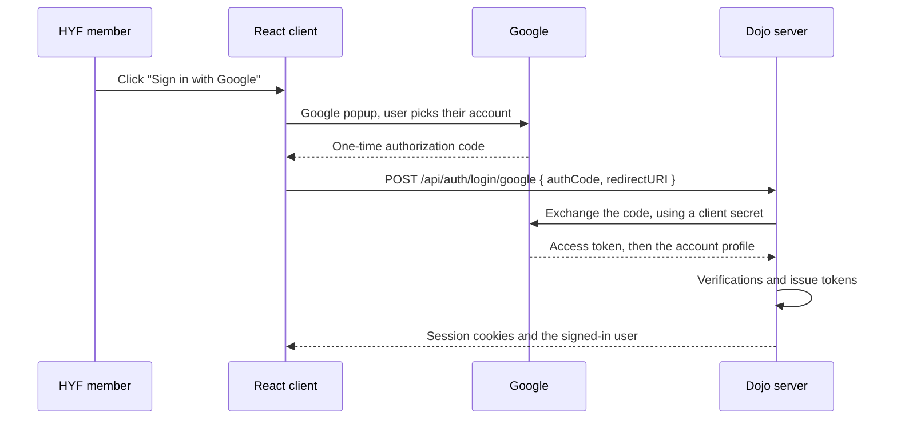

# Authentication

Dojo signs people in with their HackYourFuture Google account. The browser talks to Google, the
server verifies the result with Google directly, and only then checks whether that person has a Dojo
account. The users table is the guest list: a valid Google account is not enough.

Integrations (scripts, bots) do not sign in with Google. They carry an API token instead.

## Signing in



The server's checks, in order. Every failure below gives the same `401` message, so nobody can probe
which step said no. The one exception is the `redirectURI`, which is checked first against
`allowed-origins` and answers `400 Invalid redirectURI` — that is a client bug, not a sign-in outcome.

1. **The code is genuine.** Only Dojo holds the client secret, so only Dojo can exchange the code.
2. **The account is ours.** Google must report a verified email address and the Workspace named by
   `google-allowed-domain` — `hackyourfuture.net` in production. Outside production that setting is
   empty, so any Google account passes this step, such as a gmail one for local development.
3. **The person has a Dojo account.** Looked up by Google's permanent account id (`sub`). On a first
   sign-in the lookup falls back to the email address and remembers the `sub` from then on.
4. **The account is active.** Deactivated users cannot sign in.

## Tokens

Three kinds, each accepted in exactly one place. Sending one in the wrong place is rejected.

| Token   | Looks like   | Sent as                                            | Lifetime   |
|---------|--------------|----------------------------------------------------|------------|
| Access  | `dojo_at_…`  | `dojo_access_token` cookie                         | 15 minutes |
| Refresh | `dojo_rt_…`  | `dojo_refresh_token` cookie, only to `/api/auth/*` | 14 days    |
| API     | `dojo_api_…` | `Authorization: Bearer …` header                   | 1 year     |

Tokens are random values with no meaning of their own. The database stores only a SHA-256 hash of
each one, so nobody — including us — can read a token back out of it.

The access token is short-lived and the browser renews it with the refresh token. The refresh token
itself is never replaced, so the session always ends 14 days after signing in and the person signs in
with Google again.

Both cookies are `HttpOnly` (JavaScript cannot read them), `SameSite=Strict`, and `Secure` unless
`cookie-secure` is turned off, which only the dev profile does.

## Endpoints

| Method | Path                     | What it does                                             | Success |
|--------|--------------------------|----------------------------------------------------------|---------|
| POST   | `/api/auth/login/google` | Exchanges a Google code for a session, sets both cookies | 200     |
| POST   | `/api/auth/refresh`      | Issues a fresh access token cookie, nothing else changes | 204     |
| GET    | `/api/auth/session`      | Returns the signed-in user                               | 200     |
| POST   | `/api/auth/logout`       | Deletes both tokens and clears the cookies, always       | 204     |

No endpoint ever puts a token in a response body. The browser only ever receives cookies.

## How a request is authenticated

Every request to any other endpoint passes through one filter:

- An `Authorization: Bearer` header must hold an **API token**.
- A `dojo_access_token` cookie must hold an **access token**.
- Anything else — missing, expired, unknown, wrong kind — is treated as not signed in, and the
  request gets `401` with the standard Dojo error body.

The check reads the token's row and the user's row together, so **deactivating a user takes effect on
their very next request**, and signing out ends the session immediately. Revoking a token means
deleting its row; there is no such thing as a token that still works after it has been revoked.

## Cross-site protection

Cookies are sent by the browser automatically, so another website could try to make requests on a
signed-in user's behalf. Two things prevent it:

- `SameSite=Strict` means the browser never attaches Dojo cookies to a request started by another
  site.
- Any request that changes data and relies on a cookie must also carry an `Origin` header that Dojo
  recognises. (Browsers always send one. If you are testing with `curl`, add
  `-H "Origin: http://localhost:8888"` or the request is refused.)

Sign-in has its own protection: it only accepts `application/json`, which an HTML form cannot send.

Requests using an API token are exempt — a web page cannot set an `Authorization` header on someone
else's behalf.

## Configuration

Everything lives under `dojo.auth` in `application.yaml`.

| Setting                 | Meaning                                                       | Default                             |
|-------------------------|---------------------------------------------------------------|-------------------------------------|
| `google-client-id`      | Google OAuth client id                                        | `not-configured`                    |
| `google-client-secret`  | Google OAuth client secret                                    | `not-configured`                    |
| `google-allowed-domain` | Workspace domain allowed to sign in; empty allows any account | empty, `hackyourfuture.net` in prod |
| `access-token-ttl`      | Access token lifetime                                         | `15m`                               |
| `refresh-token-ttl`     | Refresh token lifetime                                        | `14d`                               |
| `api-token-ttl`         | API token lifetime                                            | `365d`                              |
| `cookie-secure`         | `Secure` flag on cookies (`false` in dev only)                | `true`                              |
| `allowed-origins`       | Origins allowed to sign in and to send cookies                | localhost                           |

In production the Google credentials and the allowed origins come from environment variables with no
fallback, so a missing value stops the server rather than starting it misconfigured. Everywhere else
the credentials fall back to the literal `not-configured`, which starts fine and fails at the first
sign-in attempt.

## Where the code lives

```
authentication/
  AuthenticationController      the four endpoints
  AuthenticationService         the sign-in checks and the session lifecycle
  AuthenticationCookieManager   reads, writes and clears the two cookies
  TokenAuthenticationFilter     identifies the caller on every request
  AuthenticatedUser             the principal in the SecurityContext
  AuthProperties                the dojo.auth settings
  dto/                          GoogleLoginRequest, SessionResponse, TokenResponse
  token/                        Token, TokenType, TokenService — issuing, checking, revoking
  googleoauth/                  GoogleOAuthService — the conversation with Google
config/security/
  SecurityConfig                the filter chain
  CsrfOriginFilter              the Origin check
  SecurityErrorHandler          401 and 403 in the standard Dojo error format
shared/
  SecurityUtils                 the SHA-256 used to hash tokens at rest
```
